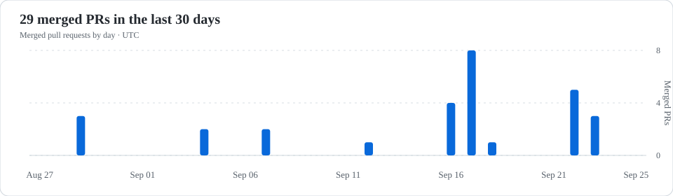
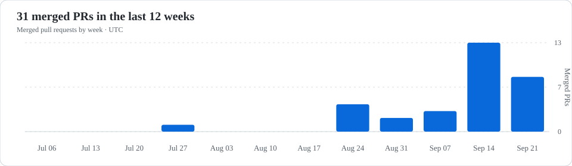
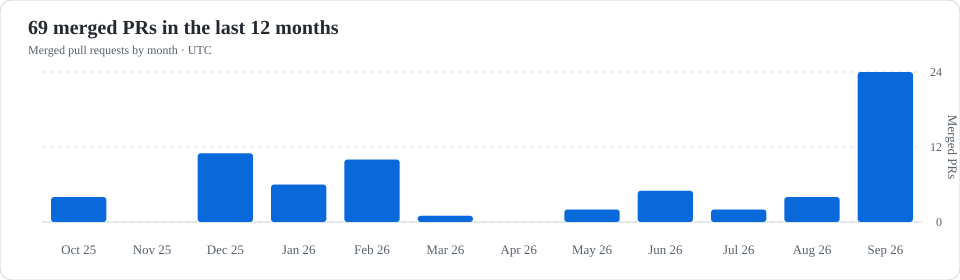

# Hi, I'm Khanh 👋

I build software, explore maps and enjoy making useful tools.

## Merged pull requests

<table>
  <tr>
    <td><strong>By day</strong> </td>
    <td><strong>By week</strong> </td>
  </tr>
  <tr>
    <td colspan="2"><strong>By month</strong> </td>
  </tr>
</table>

These charts show pull requests merged across my public and private repositories. They use UTC dates and refresh automatically every 5 minutes when GitHub Actions is available.
